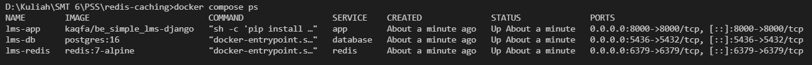
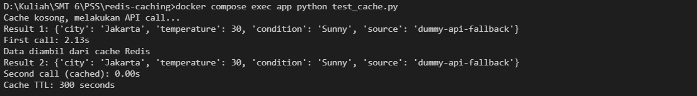

# Lab Redis Cache - Weather API

Implementasi Caching Sederhana Menggunakan Redis untuk Menyimpan Hasil API Call

---

## Alur Program

### Kode Awal (Sebelum Ada Cache)

```python
# weather_api.py - KODE INI SUDAH DIBERIKAN
import requests
import time

def get_weather(city):
   """Simulasi API call yang lambat"""
   time.sleep(2)  # Simulate slow API
   response = requests.get(f"https://api.example.com/weather/{city}")
   return response.json()

# Problem: Setiap panggil get_weather() butuh 2 detik
# Solution: Cache hasilnya di Redis selama 5 menit
```

### Kode Akhir (Sudah Pakai Redis Cache)

```python
import json
import os
import time
from typing import Any, Dict

import redis
import requests

REDIS_PORT = int(os.getenv("REDIS_PORT", "6379"))
CACHE_EXPIRE_SECONDS = 300  # 5 menit


redis_client = redis.Redis(
    host=REDIS_HOST,
    port=REDIS_PORT,
    db=0,
    decode_responses=True,  # supaya data string JSON langsung terbaca sebagai str
)

def _call_weather_api(city: str) -> Dict[str, Any]:
    """
    Fungsi ini mensimulasikan API call yang lambat.

    time.sleep(2) digunakan sesuai skenario tugas agar panggilan pertama
    terasa lambat, sedangkan panggilan kedua cepat karena mengambil cache.

    Catatan:
    URL https://api.example.com/weather/... hanya contoh. Jika endpoint tidak
    bisa diakses, fungsi tetap mengembalikan data dummy agar testing cache tetap
    dapat berjalan.
    """
    time.sleep(2)

    url = f"https://api.example.com/weather/{city}"

    try:
        response = requests.get(url, timeout=5)
        response.raise_for_status()
        return response.json()
    except requests.RequestException:
        return {
            "city": city,
            "temperature": 30,
            "condition": "Sunny",
            "source": "dummy-api-fallback",
        }

def get_weather(city: str) -> Dict[str, Any]:
    city = city.strip()
    cache_key = f"weather:{city.lower()}"

    cached_weather = redis_client.get(cache_key)

    if cached_weather is not None:
        print("Data diambil dari cache Redis")
        return json.loads(cached_weather)

    print("Cache kosong, melakukan API call...")
    weather_data = _call_weather_api(city)

    redis_client.setex(
        cache_key,
        CACHE_EXPIRE_SECONDS,
        json.dumps(weather_data),
    )

    return weather_data


if __name__ == "__main__":
    print(get_weather("Jakarta"))

```

---

## Perintah Redis yang Digunakan

| Command  | Penggunaan dalam Kode                        | Fungsi                                                                         |
| -------- | -------------------------------------------- | ------------------------------------------------------------------------------ |
| `GET`    | `r.get(cache_key)`                           | Mengambil data dari cache. Mengecek apakah data cuaca sudah tersimpan di Redis |
| `SET`    | `r.set(cache_key, json.dumps(weather_data))` | Menyimpan data cuaca ke Redis setelah berhasil dipanggil dari API              |
| `EXPIRE` | `r.expire(cache_key, 300)`                   | Mengatur masa berlaku data agar otomatis terhapus setelah 5 menit (300 detik)  |

---

## Hasil Pengujian

### 1. Status Container Docker

Perintah yang dijalankan:

```bash
docker compose ps
```



### 2. Hasil Test Cache

Perintah yang dijalankan:

```bash
docker compose exec app python test_cache.py
```



---

## Jawaban Pertanyaan

### 1. Kenapa response time berbeda?

Response time berbeda karena pada pemanggilan pertama data belum tersedia di Redis cache. Oleh karena itu, fungsi get_weather() harus menjalankan API call terlebih dahulu melalui fungsi \_call_weather_api(city). Di dalam fungsi tersebut terdapat time.sleep(2) sebagai simulasi bahwa API membutuhkan waktu sekitar 2 detik untuk memberikan respons. Pada pemanggilan kedua, data cuaca untuk kota yang sama sudah tersimpan di Redis dengan key weather:jakarta. Karena data sudah ada di cache, fungsi tidak perlu menjalankan API call ulang. Program cukup mengambil data menggunakan redis_client.get(cache_key), sehingga response time menjadi jauh lebih cepat, biasanya kurang dari 0.1 detik.

### 2. Apa keuntungan caching?

Keuntungan caching adalah mempercepat waktu respons aplikasi karena data yang pernah diambil sebelumnya dapat digunakan kembali tanpa harus melakukan proses yang sama berulang kali.Selain itu, caching juga dapat mengurangi beban API eksternal. Jika setiap request selalu memanggil API, maka aplikasi akan lebih lambat dan API eksternal akan menerima terlalu banyak permintaan. Dengan Redis cache, jumlah API call dapat dikurangi karena data sementara disimpan dan digunakan kembali selama masih valid.

### 3. Kapan sebaiknya tidak menggunakan cache?

## Cache sebaiknya tidak digunakan untuk data yang harus selalu real-time atau sangat cepat berubah. Misalnya data saldo rekening, transaksi pembayaran, status pembayaran, harga saham real-time, atau data penting lain yang harus selalu akurat pada saat itu juga. Jika data seperti ini diambil dari cache, ada risiko aplikasi menampilkan data lama yang sudah tidak sesuai dengan kondisi terbaru.
